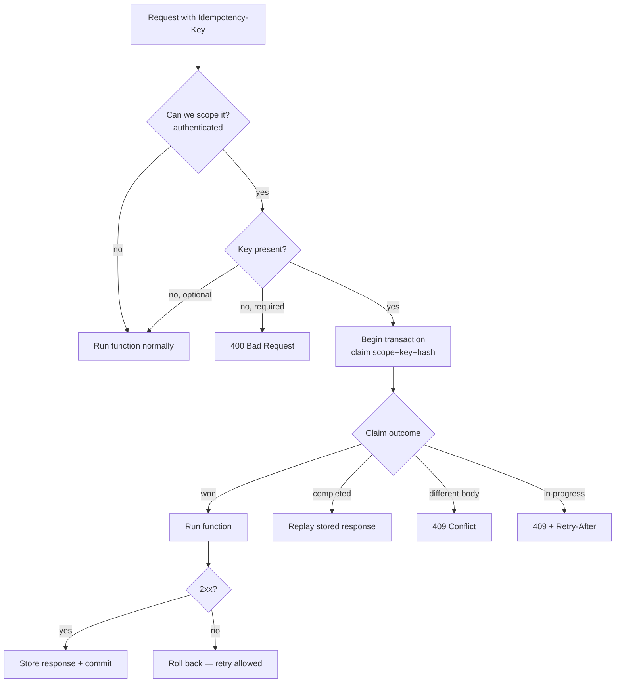

# TyFi.Idempotency

**Safe retries for your Azure Functions HTTP APIs.** Add one attribute and your endpoint
stops double-charging, double-booking, and double-sending when a client retries a request.

Networks are unreliable, so clients retry. Without idempotency, a retried `POST` runs your
command twice. `TyFi.Idempotency` gives each externally retryable request a client-supplied
key, remembers the first outcome, and makes every duplicate replay that outcome instead of
running your code again.

```csharp
[Function("CreateCharge")]
[Idempotent]                          // 👈 that's the whole opt-in
public async Task<IActionResult> Run(
    [HttpTrigger(AuthorizationLevel.Anonymous, "post")] HttpRequest req)
{
    // Runs once per (caller, Idempotency-Key, request body). Duplicates replay the result.
}
```

A client sends `Idempotency-Key: 7f3c…` with the request. The first call runs; a retry with
the same key and body **replays the stored response**; a retry with the same key but a
*different* body is rejected with `409`; and a retry that arrives while the first is still
running gets `409` + `Retry-After`.

---

## Why it's safe (the two tiers)

Idempotency is only as strong as its storage. This library offers two tiers so you pick the
guarantee you need:

| Tier | Package | Guarantee | Use when |
| --- | --- | --- | --- |
| **Transactional (strong)** | `TyFi.Idempotency.Postgres` | The idempotency ledger commits **in the same database transaction** as your command's side effect — they succeed or fail together. Atomic claim via `INSERT … ON CONFLICT`. | Money, bookings, anything that must never run twice. |
| **Best-effort** | `TyFi.Idempotency.DistributedCache` | Replays cached responses over any `IDistributedCache` (Azure Table Storage, Redis, …). No atomic claim, no transactional coupling. | Cheap deduplication where an occasional race is acceptable. |

Both tiers share the same attribute, the same request-hash identity, and the same `409` /
replay / `Retry-After` semantics — only the storage guarantee differs.

## Works with both isolated-worker HTTP models

| Your host uses… | Install this adapter |
| --- | --- |
| ASP.NET Core integration (`FunctionsApplication.CreateBuilder` + `ConfigureFunctionsWebApplication`, `HttpRequest`/`IActionResult`) | `TyFi.Idempotency.Functions.AspNetCore` |
| Built-in worker model (`ConfigureFunctionsWorkerDefaults`, `HttpRequestData`/`HttpResponseData`) | `TyFi.Idempotency.Functions.Worker` |

## Package map

- **`TyFi.Idempotency.Abstractions`** — the `[Idempotent]` attribute, the storage seam
  (`IIdempotencyStore`), the scope / unit-of-work seams, and the HTTP-agnostic executor.
- **`TyFi.Idempotency.Functions.AspNetCore`** / **`.Functions.Worker`** — the middleware
  for each HTTP model. Adds `builder.UseIdempotency()`.
- **`TyFi.Idempotency.Postgres`** — the transactional store (Npgsql).
- **`TyFi.Idempotency.DistributedCache`** — the best-effort store.
- **`TyFi.Idempotency.Functions.Core`** — shared plumbing pulled in automatically.

---

## Quick start (ASP.NET Core model + PostgreSQL)

**1. Install**

```bash
dotnet add package TyFi.Idempotency.Functions.AspNetCore
dotnet add package TyFi.Idempotency.Postgres
```

**2. Create the ledger table** (run `NpgsqlIdempotencySchema.CreateTableSql` from your
migration tooling, or copy `scripts/Script0001_IdempotencyKeys.sql` from the package):

```sql
CREATE TABLE IF NOT EXISTS idempotency_keys (
    scope text NOT NULL,
    idempotency_key text NOT NULL,
    request_hash bytea NOT NULL,
    response_status_code integer NULL,
    response_body bytea NULL,
    created_at_utc timestamptz NOT NULL DEFAULT now(),
    PRIMARY KEY (scope, idempotency_key)
);
```

**3. Wire it up in `Program.cs`**

```csharp
var builder = FunctionsApplication.CreateBuilder(args);
builder.ConfigureFunctionsWebApplication();

// Register the middleware; it only runs for functions marked [Idempotent].
builder.UseIdempotency();

// Register the transactional store + your ambient DB session (see below).
builder.Services.AddNpgsqlIdempotencyStore();
builder.Services.AddScoped<IIdempotencyScopeProvider, MyBearerScopeProvider>();
builder.Services.AddScoped<MyDbSession>();
builder.Services.AddScoped<IIdempotencyDbSession>(sp => sp.GetRequiredService<MyDbSession>());
builder.Services.AddScoped<IIdempotencyUnitOfWork>(sp => sp.GetRequiredService<MyDbSession>());

builder.Build().Run();
```

**4. Mark your endpoints**

```csharp
[Function("CreateCharge")]
[Idempotent]                                  // header defaults to "Idempotency-Key"
public Task<IActionResult> CreateCharge(...) { ... }

[Function("PlaceOrder")]
[Idempotent(HeaderName = "X-Request-Id", KeyRequired = true)]  // customise + require it
public Task<IActionResult> PlaceOrder(...) { ... }
```

That's it. See [`docs/INTEGRATION.md`](docs/INTEGRATION.md) for the two seams you implement
(scope + unit-of-work), a best-effort cache setup, and copy-paste wiring for existing apps.

---

## How a request flows



Only cacheable responses (by default `2xx`) are stored, so a `403`/`400`/`500` never gets
cached — a corrected retry always proceeds.

## Configuration knobs

- **`[Idempotent(HeaderName = "…")]`** — which header carries the key (default
  `Idempotency-Key`).
- **`[Idempotent(KeyRequired = true)]`** — reject requests without a key (`400`) instead of
  running them without idempotency.
- **`IIdempotencyResponsePolicy`** — replace to change which status codes are cacheable.
- **`IIdempotencyScopeProvider`** — you implement this to derive the caller identity (the
  library makes no assumption about your auth stack).

## Publishing

Maintainers: see [`docs/PUBLISHING.md`](docs/PUBLISHING.md) for the one-time NuGet + GitHub
Actions setup and the tag-to-release flow.

## Building locally

```bash
dotnet build
dotnet test        # unit tests + Postgres integration tests (needs Docker for Testcontainers)
```

## License

MIT.
