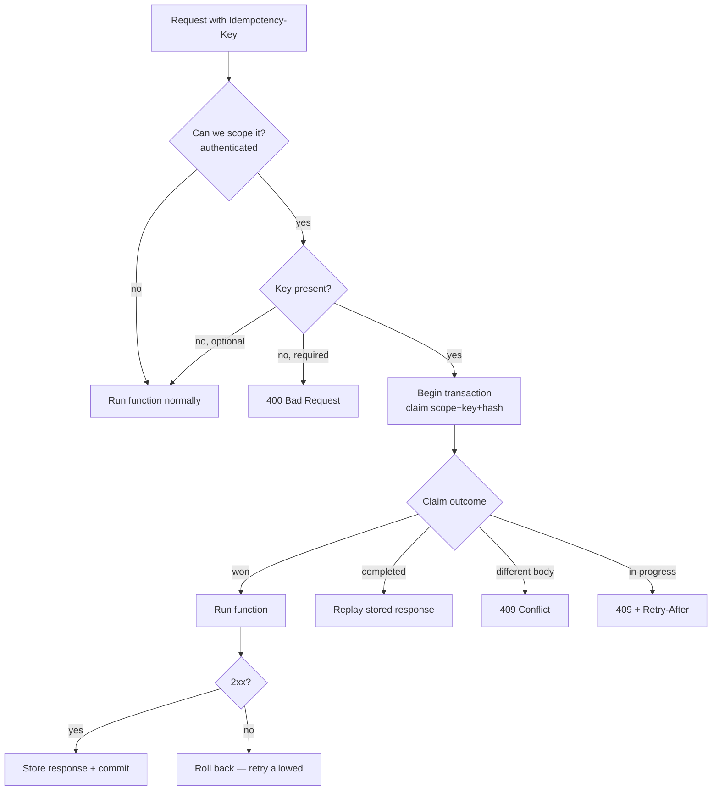

# TyFi.Idempotency

**Safe retries for your Azure Functions HTTP APIs.** Add one attribute and your endpoint
stops double-charging, double-booking, and double-sending when a client retries a request.

Networks are unreliable, so clients retry. Without idempotency, a retried `POST` runs your
command twice. `TyFi.Idempotency` gives each externally retryable request a client-supplied
key, remembers the first outcome, and makes every duplicate replay that outcome instead of
running your code again.

```csharp
[Function("CreateCharge")]
[Idempotent]                          // 👈 that's the whole opt-in
public async Task<IActionResult> Run(
    [HttpTrigger(AuthorizationLevel.Anonymous, "post")] HttpRequest req)
{
    // Runs once per (caller, Idempotency-Key, request body). Duplicates replay the result.
}
```

A client sends `Idempotency-Key: 7f3c…` with the request. The first call runs; a retry with
the same key and body **replays the stored response**; a retry with the same key but a
*different* body is rejected with `409`; and a retry that arrives while the first is still
running gets `409` + `Retry-After`.

---

## Why it's safe (pick your storage)

Idempotency is only as strong as its storage. This library separates the protocol from the
store, so you pick the guarantee you need — or bring your own:

| Tier | Package | Guarantee | Use when |
| --- | --- | --- | --- |
| **Transactional (strong)** | `TyFi.Idempotency.Postgres` | The idempotency ledger commits **in the same database transaction** as your command's side effect — they succeed or fail together. Atomic claim via `INSERT … ON CONFLICT`. | Money, bookings, anything that must never run twice. |
| **Best-effort** | `TyFi.Idempotency.DistributedCache` | Replays cached responses over any `IDistributedCache` (Azure Table Storage, Redis, …). No atomic claim, no transactional coupling. | Cheap deduplication where an occasional race is acceptable. |
| **Custom** | *your `IIdempotencyStore`* | Whatever your backend provides — you choose best-effort or full transactional coupling. | You use Cosmos DB, DynamoDB, SQL Server, MongoDB, etc. |

All three share the same attribute, the same request-hash identity, and the same `409` /
replay / `Retry-After` semantics — only the storage guarantee differs.

## Works with both isolated-worker HTTP models

| Your host uses… | Install this adapter |
| --- | --- |
| ASP.NET Core integration (`FunctionsApplication.CreateBuilder` + `ConfigureFunctionsWebApplication`, `HttpRequest`/`IActionResult`) | `TyFi.Idempotency.Functions.AspNetCore` |
| Built-in worker model (`ConfigureFunctionsWorkerDefaults`, `HttpRequestData`/`HttpResponseData`) | `TyFi.Idempotency.Functions.Worker` |

## Package map

- **`TyFi.Idempotency.Abstractions`** — the `[Idempotent]` attribute, the storage seam
  (`IIdempotencyStore`), the scope / unit-of-work seams, and the HTTP-agnostic executor.
- **`TyFi.Idempotency.Functions.AspNetCore`** / **`.Functions.Worker`** — the middleware
  for each HTTP model. Adds `builder.UseIdempotency()`.
- **`TyFi.Idempotency.Postgres`** — the transactional store (Npgsql).
- **`TyFi.Idempotency.DistributedCache`** — the best-effort store.
- **`TyFi.Idempotency.Functions.Core`** — shared plumbing pulled in automatically.

---

## Getting started

Every setup is the same three steps; then you plug in a store.

**1. Install the adapter for your HTTP model** (plus a store package from the next section):

```bash
dotnet add package TyFi.Idempotency.Functions.AspNetCore   # or TyFi.Idempotency.Functions.Worker
```

**2. Turn on the middleware and a scope provider in `Program.cs`:**

```csharp
var builder = FunctionsApplication.CreateBuilder(args);
builder.ConfigureFunctionsWebApplication();

builder.UseIdempotency();   // runs only for functions marked [Idempotent]

// You implement this — derive the caller identity that scopes keys (e.g. the bearer subject).
builder.Services.AddScoped<IIdempotencyScopeProvider, MyBearerScopeProvider>();

// ...register exactly ONE store from "Storage options" below...

builder.Build().Run();
```

> Built-in worker model? Call `workerApp.UseIdempotency()` inside
> `ConfigureFunctionsWorkerDefaults` instead.

**3. Mark the endpoints that must be idempotent:**

```csharp
[Function("CreateCharge")]
[Idempotent]                                                   // header: "Idempotency-Key"
public Task<IActionResult> CreateCharge(...) { ... }

[Function("PlaceOrder")]
[Idempotent(HeaderName = "X-Request-Id", KeyRequired = true)]  // customise + require it
public Task<IActionResult> PlaceOrder(...) { ... }
```

The only thing that changes between deployments is **which store you register**. Pick one:

## Storage options

### PostgreSQL — transactional (strong)

The ledger row commits in the same transaction as your command, so the side effect and the
idempotency record are atomic.

```bash
dotnet add package TyFi.Idempotency.Postgres
```

Create the table (run `NpgsqlIdempotencySchema.CreateTableSql` from your migrations, or copy
`scripts/Script0001_IdempotencyKeys.sql` from the package):

```sql
CREATE TABLE IF NOT EXISTS idempotency_keys (
    scope text NOT NULL,
    idempotency_key text NOT NULL,
    request_hash bytea NOT NULL,
    response_status_code integer NULL,
    response_body bytea NULL,
    created_at_utc timestamptz NOT NULL DEFAULT now(),
    PRIMARY KEY (scope, idempotency_key)
);
```

Register the store plus your ambient DB session (resolved as both the session and the unit of
work so the ledger shares the command's transaction):

```csharp
builder.Services.AddNpgsqlIdempotencyStore();
builder.Services.AddScoped<MyDbSession>();
builder.Services.AddScoped<IIdempotencyDbSession>(sp => sp.GetRequiredService<MyDbSession>());
builder.Services.AddScoped<IIdempotencyUnitOfWork>(sp => sp.GetRequiredService<MyDbSession>());
```

A complete `IIdempotencyDbSession` example is in [`docs/INTEGRATION.md`](docs/INTEGRATION.md).

### Azure Table Storage (or any `IDistributedCache`) — best-effort

Replays cached responses over any `IDistributedCache` — Azure Table Storage, Redis, a SQL
Server cache, and so on. No transactional coupling, so prefer it for cheap dedup rather than
money-critical commands.

```bash
dotnet add package TyFi.Idempotency.DistributedCache
```

```csharp
// 1. Register any IDistributedCache. For Azure Table Storage, for example:
builder.Services.AddDistributedTableStorageCache(options => { /* connection string, table */ });

// 2. Register the store (a NoOp unit of work is added automatically).
builder.Services.AddDistributedCacheIdempotencyStore(options =>
{
    options.CompletedExpiration = TimeSpan.FromHours(12);
});
```

### Custom store — implement `IIdempotencyStore`

Back idempotency with any storage (Cosmos DB, DynamoDB, SQL Server, MongoDB, …) by
implementing one interface:

```csharp
public interface IIdempotencyStore
{
    // Claim the key for this request, or report replay / mismatch / in-progress.
    Task<IdempotencyClaimResult> TryClaimAsync(
        string scope, string key, byte[] requestHash, CancellationToken ct);

    // Store the response so later duplicates replay it.
    Task CompleteAsync(
        string scope, string key, int statusCode, byte[] responseBody, CancellationToken ct);
}
```

A minimal Cosmos-style implementation — note how the create-if-absent gives you an atomic
claim:

```csharp
public sealed class CosmosIdempotencyStore : IIdempotencyStore
{
    private readonly Container _container;
    public CosmosIdempotencyStore(Container container) => _container = container;

    public async Task<IdempotencyClaimResult> TryClaimAsync(
        string scope, string key, byte[] requestHash, CancellationToken ct)
    {
        var id = $"{scope}|{key}";
        try
        {
            await _container.CreateItemAsync(
                new Ledger { Id = id, Scope = scope, RequestHash = requestHash },
                new PartitionKey(scope), cancellationToken: ct);
            return IdempotencyClaimResult.Claimed();                       // we won the claim
        }
        catch (CosmosException e) when (e.StatusCode == HttpStatusCode.Conflict)
        {
            var existing = (await _container.ReadItemAsync<Ledger>(
                id, new PartitionKey(scope), cancellationToken: ct)).Resource;

            if (!existing.RequestHash.AsSpan().SequenceEqual(requestHash))
                return IdempotencyClaimResult.RequestMismatch();           // same key, other body
            return existing.StatusCode is int status
                ? IdempotencyClaimResult.Completed(status, existing.Body!) // replay
                : IdempotencyClaimResult.InProgress();                     // still running
        }
    }

    public async Task CompleteAsync(
        string scope, string key, int statusCode, byte[] responseBody, CancellationToken ct)
    {
        var id = $"{scope}|{key}";
        var item = (await _container.ReadItemAsync<Ledger>(
            id, new PartitionKey(scope), cancellationToken: ct)).Resource;
        item.StatusCode = statusCode;
        item.Body = responseBody;
        await _container.ReplaceItemAsync(item, id, new PartitionKey(scope), cancellationToken: ct);
    }
}
```

Register it with the generic helper (it also adds a best-effort `NoOpIdempotencyUnitOfWork`):

```csharp
builder.Services.AddSingleton(cosmosContainer);
builder.Services.AddIdempotencyStore<CosmosIdempotencyStore>();
```

The four outcomes your `TryClaimAsync` returns drive the whole protocol:

| Return | Result for the caller |
| --- | --- |
| `IdempotencyClaimResult.Claimed()` | First time — the function runs. |
| `IdempotencyClaimResult.Completed(status, body)` | Same key + body already finished — response replayed. |
| `IdempotencyClaimResult.RequestMismatch()` | Same key, **different** body — `409 Conflict`. |
| `IdempotencyClaimResult.InProgress()` | An earlier request with this key is still running — `409` + `Retry-After`. |

**Want transactional coupling?** If your backend supports transactions, register your own
`IIdempotencyUnitOfWork` (begin / commit / rollback) **before** `AddIdempotencyStore<T>()` and
have the store enlist in it. The executor then commits the ledger and your command together,
exactly like the PostgreSQL tier.

---

## How a request flows



Only cacheable responses (by default `2xx`) are stored, so a `403`/`400`/`500` never gets
cached — a corrected retry always proceeds.

## Configuration knobs

- **`[Idempotent(HeaderName = "…")]`** — which header carries the key (default
  `Idempotency-Key`).
- **`[Idempotent(KeyRequired = true)]`** — reject requests without a key (`400`) instead of
  running them without idempotency.
- **`IIdempotencyResponsePolicy`** — replace to change which status codes are cacheable.
- **`IIdempotencyScopeProvider`** — you implement this to derive the caller identity (the
  library makes no assumption about your auth stack).

## Publishing

Maintainers: see [`docs/PUBLISHING.md`](docs/PUBLISHING.md) for the one-time NuGet + GitHub
Actions setup and the tag-to-release flow.

## Building locally

```bash
dotnet build
dotnet test        # unit tests + Postgres integration tests (needs Docker for Testcontainers)
```

## License

MIT.
